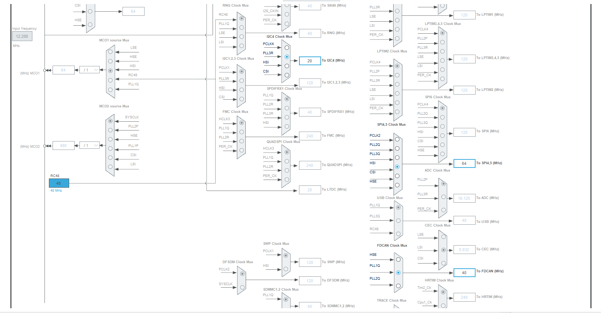

# Waypoint Estimation 

##### Code for an autonomous scale tractor using an STM32H755 dual-core module to follow GPS waypoints and communicate with a John Deere camera. Includes C implementations for sensor integration and real-time path control using SPI, I2C, UART, and CAN protocols. 

Developed by: [Humberto](https://github.com/HumbertoBM2), [Roberto](https://github.com/raymundo140), [Mauricio](https://github.com/mzzzavalas), and [Erick](https://github.com/ErickCamposA01247257)

## Overview

This project implements an autonomous waypoint estimation system using a scale tractor. The system integrates an STM32H755 dual-core microcontroller, a John Deere camera for GPS waypoint detection, and a variety of sensors and actuators to navigate a predefined route. It utilizes advanced communication protocols (SPI, I2C, UART, CAN, and wireless communication) and FreeRTOS for real-time task management.

The tractor is capable of:
- Receiving GPS coordinates from a John Deere camera.
- Using sensor data (IMU, encoder) to estimate its position and navigate accurately.
- Managing motor control (traction and steering) using PWM signals.
- Efficiently communicating data between subsystems using a modular design.

---

  

## Files

The repository is organized into the following directories:

- **Arduino**: Contains all the code for the Arduino Nano, including:
  - CAN communication to send encoder data to the STM32H755.
  - Encoder interface code to measure the DC motor's rotation.

- **STM**: Includes all the firmware for the STM32H755, organized by core functionality:
  - **M4 Core**: Dedicated to auxiliary tasks, such as toggling LEDs when the tractor crosses a waypoint.
    - `myprintf.c`: Debugging helper for message formatting.
  - **M7 Core**: Handles the main operations of the tractor, including:
    - `main.c`: Entry point for the STM32H755 firmware.
    - `freertos.c`: Implementation of FreeRTOS tasks for task management.
    - `spi.c`: SPI communication with the nRF24 wireless module and the Deere GPS camera.
    - `i2c.c`: I2C communication for reading data from the IMU.
    - `can.c`: CAN communication to receive encoder data from the Arduino Nano.
    - `steering.c`: Code for controlling the servo motor for navigation.
    - `mpu6050.c`: Driver code for the IMU module.
    - `WayPointNotify.c`: State machine implementation for waypoint notification and updates.
  - **Common Files**: Shared between the two cores.
    - `stm32h7xx_it.c`: Interrupt handlers for the SysTick and other peripherals.
    - `syscalls.c` and `sysmem.c`: System-level utilities.

- **LPS**: Contains the Python script used to operate the John Deere LPS camera, which detects the tractor's position and sends waypoint coordinates wirelessly.

- **Gallery**: Includes images and videos documenting the project development process, such as:
  - System schematics.
  - Pin configurations.
  - Testing area and final product images.

---

## Prerequisites

To replicate this project, you will need:
- STM32H755 dual core module
- Arduino Nano
- ESC Module
- nRF24 Wireless module
- TJA1051 CAN transceiver
- MCP2515 CAN Shield
- DC motor with encoder (Powered by a 9 V battery)
- Servo motor
- LM2596 Voltage regulator
- LPS John Deere Camera
- 3.7 V LiPo Battery
- MPU6050 IMU Module
- 9 V Battery
- Breadboards
- Jumper wires
- 4 AA Batteries (6 V) 

---

## Schematic

The complete schematic of the system, including all components and connections, can be found in the `Gallery` folder. Below is a preview:

---

## Final product

The final integrated system demonstrates a fully functional scale tractor navigating a U-shaped route with waypoint notifications and updates. Below is an image of the final product:

---

## Testing area

The testing area consisted of a controlled black environment monitored by the John Deere camera, which provided the GPS coordinates for the tractor's navigation. A snapshot of the testing area is shown below:

---

## IOC, Pins and peripherals

The project utilized a wide array of peripherals configured in the STM32CubeMX `.ioc` file. These configurations include:
- SPI: For nRF24 and Deere GPS camera communication.
- CAN: For communication between STM32 and Arduino.
- I2C: For IMU data acquisition.
- UART: For debugging and serial communication.
- PWM: For motor control (traction and steering).

---

## Clock configurations

The STM32H755's clock was configured for optimal performance using:
- **System Clock (HCLK)**: Configured to 400 MHz for efficient dual-core operation.
- **Peripheral Clocks**: Adjusted to meet the timing requirements of SPI, I2C, and CAN modules.

Details of the clock configuration are shown below:

---

## Diagrams

The project includes several development diagrams to illustrate system design:

---
